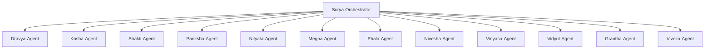

# SuryaPrajna Agents

> Universal PV scientific agents for any LLM platform — Claude, GPT, Gemini, Perplexity, Codex, Cursor, or any agent runtime.

## How to Use This File

**If you are an LLM agent** reading this file, follow these instructions to discover and invoke SuryaPrajna skills:

1. **Read this file** to understand the agent architecture and skill routing
2. **Match the user's request** to a domain agent using the routing table below
3. **Load the relevant SKILL.md** from `skills/<pack>/<skill-name>/SKILL.md`
4. **Follow the LLM Instructions** section in the SKILL.md — it contains your role, thinking process, output format, and quality criteria
5. **Combine multiple skills** when the request spans domains

**If you are a human developer**, this file documents the agent architecture and serves as the entry point for configuring agent-based workflows.

---

## Quick Routing Table

Use this table to route any PV-related request to the correct skill pack and agent:

| User Request Contains | Route To | Pack | Available Skills |
|---|---|---|---|
| IEC 61215, test protocol, qualification, test sequence | Pariksha-Agent | `pv-testing` | `iec-61215-protocol` |
| IEC 61730, safety, insulation, dielectric, fire class | Pariksha-Agent | `pv-testing` | `iec-61730-safety` |
| Thermal cycling, TC200, TC400, solder fatigue | Pariksha-Agent | `pv-testing` | `thermal-cycling` |
| Damp heat, DH1000, moisture ingress, 85/85 | Pariksha-Agent | `pv-testing` | `damp-heat-testing` |
| UV test, yellowing, transmittance, preconditioning | Pariksha-Agent | `pv-testing` | `uv-preconditioning` |
| Mechanical load, wind load, snow load, deflection | Pariksha-Agent | `pv-testing` | `mechanical-load` |
| Flash test, I-V curve, STC measurement, IV parameters | Pariksha-Agent | `pv-testing` | `pv-module-flash-testing` |
| FMEA, failure mode, RPN, risk assessment | Nityata-Agent | `pv-reliability` | `fmea-analysis` |
| Weibull, reliability, MTTF, B-life, failure rate | Nityata-Agent | `pv-reliability` | `weibull-reliability` |
| Degradation, LID, LeTID, PID, annual loss | Nityata-Agent | `pv-reliability` | `degradation-modeling` |
| Root cause, 5-Why, Ishikawa, fault tree, field failure | Nityata-Agent | `pv-reliability` | `root-cause-analysis` |
| Change notice, release note, ECO, revision control | Nityata-Agent | `pv-reliability` | `cn-rn-documentation` |
| pvlib, energy yield, irradiance, solar simulation | Phala-Agent | `pv-energy` | `pvlib-analysis` |
| Materials, silicon, perovskite, XRD, SEM, defect | Dravya-Agent | `pv-materials` | *(planned)* |
| BoM, cell-to-module, lamination, encapsulant selection | Kosha-Agent | `pv-cell-module` | *(planned)* |
| I-V modeling, diode model, efficiency, temperature coeff | Shakti-Agent | `pv-cell-module` | *(planned)* |
| Weather, TMY, irradiance data, GHI/DNI, solar resource | Megha-Agent | `pv-energy` | *(planned)* |
| LCOE, IRR, NPV, payback, carbon credit, bankability | Nivesha-Agent | `pv-finance` | *(planned)* |
| Array layout, rooftop, string sizing, shading, SLD | Vinyasa-Agent | `pv-plant-design` | *(planned)* |
| Inverter, MPPT, battery, grid, harmonics, load flow | Vidyut-Agent | `pv-power-systems` | *(planned)* |
| Report, datasheet, compliance doc, LCA, ESG | Grantha-Agent | `pv-sustainability` | *(planned)* |

---

## LLM Behavioral Instructions

When executing any SuryaPrajna skill, every LLM agent MUST follow these universal rules:

### 1. Always Load the SKILL.md First
Before answering a PV domain question, locate and read the matching `SKILL.md` file. The file path follows the pattern:
```
skills/<pack-name>/<skill-name>/SKILL.md
```
The SKILL.md contains the **LLM Instructions** section with your role definition, thinking process, output format, and quality criteria. Follow them.

### 2. Adopt the Role
Each skill defines a **Role Definition** (e.g., "You are a senior PV test engineer"). Adopt that persona for the duration of the interaction. This means:
- Use domain-specific terminology correctly
- Apply engineering judgment, not just template responses
- Cite IEC standards, equations, and physical constants accurately
- Flag when input data is insufficient or inconsistent

### 3. Follow the Thinking Process
Each skill defines a **step-by-step reasoning chain**. Execute each step in order. Do not skip steps. If the user's request is ambiguous, ask clarifying questions before proceeding — especially about:
- Module technology (PERC, TOPCon, HJT, thin-film)
- Climate zone (hot-humid, hot-arid, temperate, cold, marine)
- Standard edition (IEC 61215:2016 vs 2021)
- System scale (residential, commercial, utility)

### 4. Use Correct Units and Precision
| Quantity | Unit | Typical Range |
|---|---|---|
| Irradiance | W/m² | 0–1400 |
| Energy | kWh or MWh | — |
| Power | W, kW, or MW | — |
| Temperature | °C | -40 to +85 (testing), -10 to +50 (field) |
| Temperature coefficient | %/°C or mV/°C | -0.25 to -0.45 %/°C (Pmax for c-Si) |
| Pressure (mechanical load) | Pa | 2400–5400 |
| Degradation rate | %/year | 0.3–1.0 |
| RPN (FMEA) | dimensionless | 1–1000 |

### 5. Validate Before Responding
Before delivering output, self-check against the skill's **Quality Criteria**. Common validations:
- Are all numerical values accompanied by units?
- Do referenced standards include the edition year?
- Are acceptance criteria quantitative (not vague)?
- Is the output format consistent with the skill's specification?
- Would a PV engineer find this actionable?

### 6. Handle Multi-Skill Requests
When a user request spans multiple skills:
1. Decompose the request into sub-tasks
2. Identify which skills address each sub-task
3. Execute skills in dependency order (e.g., flash test data → degradation modeling → warranty analysis)
4. Synthesize results into a unified response
5. Cross-reference findings across skills (e.g., FMEA failure modes ↔ degradation mechanisms)

---

## Agent Architecture



### Surya-Orchestrator

**Role:** Master task router and workflow coordinator

- Routes incoming requests to the appropriate domain agent(s)
- Coordinates multi-agent workflows via Srishti workflow engine
- Manages context passing between agents
- Handles ambiguous requests by decomposing into sub-tasks

**Trigger patterns:** Any PV-related query that spans multiple domains or needs routing.

**LLM behavior:** When you cannot determine which single agent should handle a request, act as the orchestrator. Decompose the request, invoke skills from multiple packs, and synthesize the results.

---

## Domain Agents

### Pariksha-Agent (Testing & Compliance)

**Sanskrit:** _Pariksha_ = examination, test
**Domain:** `pv-testing` — 7 skills available

**When to invoke:** User asks about IEC test protocols, qualification testing, lab procedures, flash testing, environmental stress tests, or compliance checklists.

**Available skills:**

| Skill | File | Trigger Keywords |
|---|---|---|
| `iec-61215-protocol` | `skills/pv-testing/iec-61215-protocol/SKILL.md` | IEC 61215, design qualification, MQT, test sequence |
| `iec-61730-safety` | `skills/pv-testing/iec-61730-safety/SKILL.md` | IEC 61730, safety, insulation, fire class, MST |
| `thermal-cycling` | `skills/pv-testing/thermal-cycling/SKILL.md` | TC200, TC400, thermal stress, Coffin-Manson |
| `damp-heat-testing` | `skills/pv-testing/damp-heat-testing/SKILL.md` | DH1000, 85/85, moisture, Arrhenius |
| `uv-preconditioning` | `skills/pv-testing/uv-preconditioning/SKILL.md` | UV test, yellowing index, MQT 10 |
| `mechanical-load` | `skills/pv-testing/mechanical-load/SKILL.md` | Wind load, snow load, MQT 16, deflection |
| `pv-module-flash-testing` | `skills/pv-testing/pv-module-flash-testing/SKILL.md` | Flash test, I-V curve, STC, IEC 60891 |

---

### Nityata-Agent (Reliability & Quality)

**Sanskrit:** _Nityata_ = permanence, reliability
**Domain:** `pv-reliability` — 5 skills available

**When to invoke:** User asks about failure analysis, reliability prediction, degradation mechanisms, root cause investigation, or change management documentation.

**Available skills:**

| Skill | File | Trigger Keywords |
|---|---|---|
| `fmea-analysis` | `skills/pv-reliability/fmea-analysis/SKILL.md` | FMEA, failure mode, RPN, risk priority |
| `weibull-reliability` | `skills/pv-reliability/weibull-reliability/SKILL.md` | Weibull, reliability, MTTF, B-life, hazard rate |
| `degradation-modeling` | `skills/pv-reliability/degradation-modeling/SKILL.md` | LID, LeTID, PID, degradation rate, lifetime |
| `root-cause-analysis` | `skills/pv-reliability/root-cause-analysis/SKILL.md` | 5-Why, Ishikawa, fault tree, field failure |
| `cn-rn-documentation` | `skills/pv-reliability/cn-rn-documentation/SKILL.md` | Change notice, release note, ECO, revision |

---

### Phala-Agent (Energy Yield & Diagnostics)

**Sanskrit:** _Phala_ = fruit, result, yield
**Domain:** `pv-energy` — 1 skill available

**When to invoke:** User asks about energy yield simulation, pvlib modeling, irradiance calculation, or PV system performance.

**Available skills:**

| Skill | File | Trigger Keywords |
|---|---|---|
| `pvlib-analysis` | `skills/pv-energy/pvlib-analysis/SKILL.md` | pvlib, energy yield, irradiance, solar simulation |

---

### Dravya-Agent (Materials Science)

**Sanskrit:** _Dravya_ = substance, material
**Domain:** `pv-materials` — planned

**When to invoke:** User asks about silicon characterization, perovskite modeling, thin-film properties, XRD/SEM analysis, or material defects.

**Key skills (planned):** `xrd-analysis`, `sem-interpretation`, `el-imaging`, `defect-classifier`, `perovskite-modeler`, `silicon-characterization`

---

### Kosha-Agent (Bill of Materials & Components)

**Sanskrit:** _Kosha_ = sheath, layer, enclosure
**Domain:** `pv-cell-module` — planned

**When to invoke:** User asks about BoM generation, CTM calculations, module construction, lamination, or component selection.

**Key skills (planned):** `bom-generator`, `ctm-calculator`, `module-construction`, `lamination-params`

---

### Shakti-Agent (Cell & Module Performance)

**Sanskrit:** _Shakti_ = power, energy, strength
**Domain:** `pv-cell-module` — planned

**When to invoke:** User asks about I-V curve modeling, cell efficiency, diode models, or temperature coefficients.

**Key skills (planned):** `iv-curve-modeler`, `cell-efficiency`, `diode-model`, `temperature-coefficients`

---

### Megha-Agent (Weather & Irradiance)

**Sanskrit:** _Megha_ = cloud
**Domain:** `pv-energy` — planned

**When to invoke:** User asks about weather data ingestion, TMY files, irradiance decomposition, or solar resource assessment.

**Key skills (planned):** `weather-data-ingestion`, `irradiance-modeler`, `solar-resource-assessment`, `climate-analysis`

---

### Nivesha-Agent (Finance & Economics)

**Sanskrit:** _Nivesha_ = investment
**Domain:** `pv-finance` — planned

**When to invoke:** User asks about LCOE, financial modeling, carbon credits, policy compliance, or bankability.

**Key skills (planned):** `lcoe-calculator`, `financial-modeler`, `carbon-credits`, `policy-compliance`, `bankability-assessment`

---

### Vinyasa-Agent (Plant Design & Layout)

**Sanskrit:** _Vinyasa_ = arrangement, layout
**Domain:** `pv-plant-design` — planned

**When to invoke:** User asks about array layout, rooftop design, floating solar, shading analysis, string sizing, or SLD generation.

**Key skills (planned):** `array-layout`, `shading-analysis`, `string-sizing`, `sld-generator`, `rooftop-design`, `floating-solar`

---

### Vidyut-Agent (Power Systems & Grid)

**Sanskrit:** _Vidyut_ = electricity
**Domain:** `pv-power-systems` — planned

**When to invoke:** User asks about load flow, hybrid systems, MPPT, inverter modeling, BESS sizing, grid integration, or harmonics.

**Key skills (planned):** `load-flow-analysis`, `hybrid-modeling`, `mppt-analysis`, `bess-sizing`, `grid-integration`, `inverter-modeling`

---

### Grantha-Agent (Documentation & Compliance)

**Sanskrit:** _Grantha_ = book, document, treatise
**Domain:** Cross-cutting (all packs), `pv-scientific-writing`

**When to invoke:** User asks about technical reports, datasheets, compliance documentation, LCA reports, or regulatory filings.

**Key skills (planned):** `report-generator`, `datasheet-creator`, `compliance-docs`, `lca-report`, `eia-report`

---

## Skill Discovery Protocol

For any LLM agent integrating with SuryaPrajna, follow this protocol to discover and invoke skills:

### Step 1: Identify the Domain
Parse the user's request for domain keywords. Use the Quick Routing Table above.

### Step 2: Load the Skill
Read the SKILL.md file at the path indicated in the routing table:
```
skills/<pack>/<skill-name>/SKILL.md
```

### Step 3: Parse the SKILL.md Structure
Every SKILL.md follows this structure:
```yaml
---
# YAML frontmatter: name, version, description, tags, dependencies, pack, agent
---
# Skill Title
[Introduction paragraph]

## LLM Instructions        ← YOUR BEHAVIORAL INSTRUCTIONS
### Role Definition         ← Who you become
### Thinking Process        ← Step-by-step reasoning chain
### Output Format           ← How to structure your response
### Quality Criteria        ← Self-validation checklist
### Common Pitfalls         ← What to avoid
### Example Interaction Patterns  ← How to handle different request types

## Capabilities             ← What the skill can do
## Parameters               ← Input parameters
## Tool Definitions         ← Callable tools (if any)
## Example Usage            ← Detailed examples with expected output
## Output Format            ← Deliverable specifications
## Standards & References   ← IEC standards, papers, books
## Related Skills           ← Cross-references to other skills
```

### Step 4: Execute
1. Adopt the Role Definition
2. Follow the Thinking Process step by step
3. Format output per the Output Format specification
4. Validate against Quality Criteria before responding
5. Cross-reference Related Skills if the request spans domains

---

## Viveka-Agent (API Integrations & Knowledge Retrieval)

**Sanskrit:** _Viveka_ = wisdom, discernment, knowledge discrimination
**Domain:** `pv-integrations`

**Capabilities:**
- Technical report generation
- Datasheet creation and validation
- IEC / BIS standards compliance documentation
- Environmental compliance (EIA, ESG) reports
- Project proposal document automation
- LCA (Life Cycle Assessment) reports
- Quality management documentation
- Regulatory filing preparation
- Scientific manuscript authoring with publisher-specific formatting (Wiley, Elsevier, IEEE, Springer, Nature, SPIE)
- Systematic literature review with Semantic Scholar, Perplexity AI, Zotero integration
- Publication-quality figure generation (I-V curves, EQE, loss trees, EL/IR analysis)
- Multi-section report compilation with cross-referencing and multi-format export

**Key skills:** `report-generator`, `datasheet-creator`, `compliance-docs`, `lca-report`, `eia-report`, `manuscript-writer`, `literature-review`, `figure-generator`, `report-compiler`
- Semantic vector search over indexed PV literature (Pinecone RAG)
- Reference management: import, export, and bibliography generation (Zotero)
- Academic paper discovery across Semantic Scholar, CrossRef, and Scopus
- Real-time literature search and fact verification (Perplexity AI)
- AI writing assistance and literature review augmentation (Jenni.ai)
- Citation network analysis and influential paper identification
- Cross-source knowledge deduplication and indexing pipeline
- Grounding LLM responses in retrieved, cited sources

**Key skills:** `pinecone-connector`, `zotero-connector`, `scholar-gateway`, `perplexity-connector`, `jenni-connector`

**Invoked by:** All domain agents when they need external literature, citations, or writing assistance.

---

## Adding New Agents

To add a new domain agent:

1. Create a new skill pack directory under `skills/`
2. Define skills with `SKILL.md` files following the Agent Skills standard
3. Include the `## LLM Instructions` section with all 6 subsections
4. Add the agent definition in `.claude/agents/`
5. Register the agent in this file with its Sanskrit name, domain, trigger keywords, and skill table
6. Update `SKILLS.md` registry

Example future agents:
- **Saura-Agent** (_Saura_ = solar): EV charging integration (`pv-ev-charging`)
- **Jala-Agent** (_Jala_ = water): Hydrogen production (`pv-hydrogen`)
- **Krishi-Agent** (_Krishi_ = agriculture): Agrivoltaics (`pv-agrivoltaics`)
