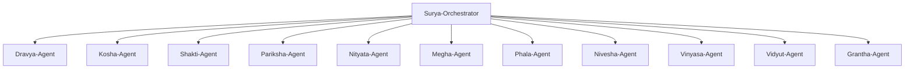

# SuryaPrajna Agents

> Sanskrit-named PV domain agents that orchestrate skills across the solar energy value chain.

## Agent Architecture

---

## Surya-Orchestrator

**Role:** Master task router and workflow coordinator

- Routes incoming requests to the appropriate domain agent(s)
- Coordinates multi-agent workflows via Srishti workflow engine
- Manages context passing between agents
- Handles ambiguous requests by decomposing into sub-tasks

**Trigger patterns:** Any PV-related query that spans multiple domains or needs routing.

---

## Dravya-Agent (Materials Science)

**Sanskrit:** _Dravya_ = substance, material
**Domain:** `pv-materials`

**Capabilities:**
- Silicon characterization and wafer quality analysis
- Perovskite composition modeling and stability prediction
- Thin-film (CdTe, CIGS, a-Si) material property analysis
- XRD, SEM, EL, IR image interpretation
- Defect classification (LeTID, PID, UV degradation)
- Material degradation physics modeling

**Key skills:** `xrd-analysis`, `sem-interpretation`, `el-imaging`, `defect-classifier`, `perovskite-modeler`, `silicon-characterization`

---

## Kosha-Agent (Bill of Materials & Components)

**Sanskrit:** _Kosha_ = sheath, layer, enclosure
**Domain:** `pv-cell-module`

**Capabilities:**
- BoM (Bill of Materials) generation and validation
- CTM (Cell-to-Module) loss/gain calculations
- Component specification comparison
- Lamination process parameters
- Module construction design review
- Encapsulant, backsheet, glass, frame selection

**Key skills:** `bom-generator`, `ctm-calculator`, `module-construction`, `lamination-params`

---

## Shakti-Agent (Cell & Module Performance)

**Sanskrit:** _Shakti_ = power, energy, strength
**Domain:** `pv-cell-module`

**Capabilities:**
- I-V curve modeling and analysis
- Cell efficiency calculations (STC, NOCT)
- Temperature coefficient analysis
- Series/shunt resistance extraction
- Diode model parameter fitting (single/double diode)
- Module power rating verification

**Key skills:** `iv-curve-modeler`, `cell-efficiency`, `diode-model`, `temperature-coefficients`

---

## Pariksha-Agent (Testing & Compliance)

**Sanskrit:** _Pariksha_ = examination, test
**Domain:** `pv-testing`

**Capabilities:**
- IEC 61215 / IEC 61730 test protocol generation
- Flash testing data analysis
- EL (Electroluminescence) test interpretation
- Thermal cycling and damp heat test evaluation
- Field testing: PR ratio, soiling loss, degradation rate
- NABL/BIS compliance checklists
- UV preconditioning and humidity-freeze protocols

**Key skills:** `iec-61215-protocol`, `iec-61730-safety`, `thermal-cycling`, `damp-heat-testing`, `uv-preconditioning`, `mechanical-load`, `pv-module-flash-testing`

---

## Nityata-Agent (Reliability & Quality)

**Sanskrit:** _Nityata_ = permanence, reliability
**Domain:** `pv-reliability`

**Capabilities:**
- FMEA (Failure Mode and Effects Analysis)
- Weibull distribution analysis for lifetime prediction
- MTBF (Mean Time Between Failures) calculation
- RCA (Root Cause Analysis) facilitation
- CN/RN (Change Notice / Release Note) document automation
- Degradation rate modeling
- Warranty reserve calculations

**Key skills:** `fmea-analysis`, `weibull-reliability`, `degradation-modeling`, `root-cause-analysis`, `cn-rn-documentation`, `warranty-analysis`

---

## Megha-Agent (Weather & Irradiance)

**Sanskrit:** _Megha_ = cloud
**Domain:** `pv-energy`

**Capabilities:**
- Weather data ingestion (TMY, MERRA-2, ERA5, NSRDB)
- GHI/DNI/DHI decomposition and transposition
- Irradiance modeling (Perez, Hay-Davies, isotropic)
- Solar resource assessment
- Climate zone classification
- Long-term variability analysis

**Key skills:** `weather-data-ingestion`, `irradiance-modeler`, `solar-resource-assessment`, `climate-analysis`

---

## Phala-Agent (Energy Yield & Diagnostics)

**Sanskrit:** _Phala_ = fruit, result, yield
**Domain:** `pv-energy`

**Capabilities:**
- Energy yield simulation (pvlib, PVsyst, SAM integration)
- P50/P90 exceedance probability analysis
- Loss tree construction and analysis
- PR (Performance Ratio) monitoring
- IV curve tracing diagnostics
- Thermal imaging analysis
- Soiling and degradation impact assessment
- Energy forecasting (statistical and ML-based)

**Key skills:** `pvlib-analysis`, `energy-yield`, `p50-p90-analysis`, `loss-tree`, `pr-monitoring`, `energy-forecasting`

---

## Nivesha-Agent (Finance & Economics)

**Sanskrit:** _Nivesha_ = investment
**Domain:** `pv-finance`

**Capabilities:**
- LCOE (Levelized Cost of Energy) calculation
- IRR, NPV, payback period analysis
- Carbon credit and REC calculations
- Policy compliance (ALMM, DCR, MNRE guidelines)
- Bankability assessment
- Financing structure analysis (PPA, lease, loan)
- Sensitivity and scenario analysis

**Key skills:** `lcoe-calculator`, `financial-modeler`, `carbon-credits`, `policy-compliance`, `bankability-assessment`

---

## Vinyasa-Agent (Plant Design & Layout)

**Sanskrit:** _Vinyasa_ = arrangement, layout
**Domain:** `pv-plant-design`

**Capabilities:**
- Ground-mount array layout optimization
- Rooftop system design
- Floating solar (FPV) design
- BIPV/VIPV/facade integration design
- Shading analysis (horizon, inter-row, near-field)
- String sizing and inverter matching
- SLD (Single Line Diagram) generation
- Cable sizing and routing
- Design documentation and reports

**Key skills:** `array-layout`, `shading-analysis`, `string-sizing`, `sld-generator`, `rooftop-design`, `floating-solar`

---

## Vidyut-Agent (Power Systems & Grid)

**Sanskrit:** _Vidyut_ = electricity
**Domain:** `pv-power-systems`

**Capabilities:**
- Transmission and switchgear system design
- Load flow analysis and power flow studies
- Hybrid generation modeling (solar+wind+battery+diesel)
- MPPT algorithm analysis and comparison
- Inverter modeling (string, central, micro)
- BESS (Battery Energy Storage) sizing
- Round-trip efficiency calculations
- Grid integration and power quality analysis
- Harmonic analysis and THD compliance

**Key skills:** `load-flow-analysis`, `hybrid-modeling`, `mppt-analysis`, `bess-sizing`, `grid-integration`, `inverter-modeling`

---

## Grantha-Agent (Documentation & Compliance)

**Sanskrit:** _Grantha_ = book, document, treatise
**Domain:** Cross-cutting (all packs), `pv-scientific-writing`

**Capabilities:**
- Technical report generation
- Datasheet creation and validation
- IEC / BIS standards compliance documentation
- Environmental compliance (EIA, ESG) reports
- Project proposal document automation
- LCA (Life Cycle Assessment) reports
- Quality management documentation
- Regulatory filing preparation
- Scientific manuscript authoring with publisher-specific formatting (Wiley, Elsevier, IEEE, Springer, Nature, SPIE)
- Systematic literature review with Semantic Scholar, Perplexity AI, Zotero integration
- Publication-quality figure generation (I-V curves, EQE, loss trees, EL/IR analysis)
- Multi-section report compilation with cross-referencing and multi-format export

**Key skills:** `report-generator`, `datasheet-creator`, `compliance-docs`, `lca-report`, `eia-report`, `manuscript-writer`, `literature-review`, `figure-generator`, `report-compiler`

---

## Adding New Agents

To add a new domain agent:

1. Create a new skill pack directory under `skills/`
2. Define skills with `SKILL.md` files following the Agent Skills standard
3. Add the agent definition in `.claude/agents/`
4. Register the agent in this file with its Sanskrit name, domain, and capabilities
5. Update `SKILLS.md` registry

Example future agents:
- **Saura-Agent** (_Saura_ = solar): EV charging integration (`pv-ev-charging`)
- **Jala-Agent** (_Jala_ = water): Hydrogen production (`pv-hydrogen`)
- **Krishi-Agent** (_Krishi_ = agriculture): Agrivoltaics (`pv-agrivoltaics`)
