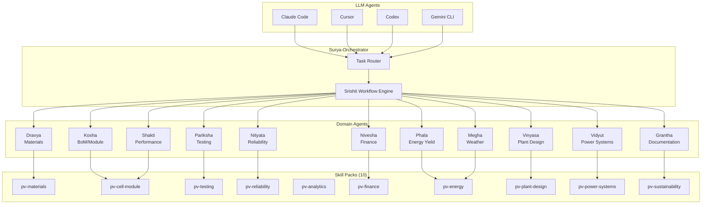

# SuryaPrajna

**SuryaPrajna** (Sanskrit: _Surya_ = Sun, _Prajna_ = Wisdom) — Universal PV Scientific Skills for the Entire Solar Energy Value Chain.

> "Solar Wisdom" — a comprehensive, open-standard scientific skills workspace that gives LLM agents deep expertise across photovoltaic materials, testing, reliability, energy yield, finance, plant design, and power systems.

[](https://opensource.org/licenses/MIT)
[](https://agentskills.io)
[]()

## Why SuryaPrajna?

PV engineers spend hours on repetitive analytical tasks — generating test protocols, running yield simulations, performing FMEA, creating compliance documents. SuryaPrajna encodes this domain expertise as **universal agent skills** that work with any LLM:

- **Claude Code** — Native integration via `.claude/` directory
- **Cursor** — Skills as context documents
- **Codex** — SKILL.md as function specifications
- **Gemini CLI** — Agent Skills standard compatibility
- **Any LLM Agent** — Open standard, no vendor lock-in

## Architecture



## Skill Packs

| # | Pack | Skills | Domain | Agent |
|---|------|--------|--------|-------|
| 1 | `pv-materials` | 6 | Silicon, perovskite, thin-film, defect analysis, imaging | Dravya |
| 2 | `pv-cell-module` | 8 | BoM, CTM, I-V curves, cell efficiency, module construction | Kosha, Shakti |
| 3 | `pv-testing` | 7 | IEC 61215/61730, flash testing, field testing, NABL | Pariksha |
| 4 | `pv-reliability` | 6 | FMEA, Weibull, RCA, CN/RN, degradation modeling | Nityata |
| 5 | `pv-analytics` | 5 | ANOVA, regression, SPC, Monte Carlo, uncertainty (GUM) | Cross-cutting |
| 6 | `pv-finance` | 6 | LCOE, IRR/NPV, carbon credits, policy, bankability | Nivesha |
| 7 | `pv-energy` | 10 | pvlib, yield, P50/P90, weather, forecasting, diagnostics | Megha, Phala |
| 8 | `pv-plant-design` | 7 | Layout, shading, string sizing, SLD, rooftop, floating | Vinyasa |
| 9 | `pv-power-systems` | 7 | Load flow, hybrid, MPPT, BESS, grid, power quality | Vidyut |
| 10 | `pv-sustainability` | 5 | LCA, carbon, ESG, recycling, policy frameworks | Cross-cutting |

**Total: ~67 skills** across 10 packs, with more planned.

## Repository Structure

```
SuryaPrajna/
├── skills/                    # PV domain skills (Agent Skills standard)
│   ├── pv-materials/
│   ├── pv-cell-module/
│   ├── pv-testing/
│   │   └── iec-61215-protocol/SKILL.md
│   ├── pv-reliability/
│   ├── pv-analytics/
│   ├── pv-finance/
│   ├── pv-energy/
│   │   └── pvlib-analysis/SKILL.md
│   ├── pv-plant-design/
│   ├── pv-power-systems/
│   └── pv-sustainability/
├── .claude/                   # Claude Code integration
│   ├── skills/                # Skill discovery
│   ├── commands/              # Slash commands
│   └── agents/                # Agent definitions
├── packages/
│   ├── connectors/            # Pinecone, Zotero, weather APIs
│   ├── srishti-workflow/      # Orchestration engine
│   └── ui/                    # Shared components
├── apps/
│   ├── web/                   # Next.js application
│   └── desktop/               # Tauri shell (future)
├── knowledge/                 # Reference standards index
├── templates/                 # Report & datasheet templates
├── AGENTS.md                  # Agent architecture & definitions
├── SKILLS.md                  # Master skills registry
├── CLAUDE.md                  # Claude Code project instructions
├── PRD.md                     # Product requirements
└── TASKS.md                   # Task tracker
```

## Getting Started

### Claude Code

```bash
# Clone the repository
git clone https://github.com/ganeshgowri-ASA/SuryaPrajna.git
cd SuryaPrajna

# Claude Code automatically discovers skills via .claude/ directory
# Start using skills directly:
claude "Calculate annual energy yield for a 10 MWp plant in Rajasthan using pvlib"
claude "Generate IEC 61215 TC200 test protocol for a 550W TOPCon module"
```

### Cursor

```
# Open the repository in Cursor
# Skills are available as context documents
# Reference SKILL.md files in your prompts for domain expertise
```

### Codex (OpenAI)

```bash
# Skills serve as function specifications
# Reference skills/<pack>/<skill>/SKILL.md for structured PV domain knowledge
codex "Using the pvlib-analysis skill, model a 5 MWp system in Gujarat"
```

### Gemini CLI

```bash
# Agent Skills standard is natively supported
gemini "Apply iec-61215-protocol skill for module qualification testing"
```

### Any LLM Agent

Skills follow the open [Agent Skills](https://agentskills.io) standard. Each `SKILL.md` contains:
- YAML frontmatter (name, version, tags, dependencies)
- Capability descriptions
- Parameter specifications
- Example prompts and expected outputs
- Related standards references

Feed the relevant `SKILL.md` as context to any LLM for domain-specific PV expertise.

## Srishti Workflow Engine

**Srishti** (Sanskrit: _creation_) is the orchestration engine that chains skills into multi-step workflows.

### Example: Full Project Assessment


1. **Megha-Agent** assesses solar resource using weather data
2. **Vinyasa-Agent** creates preliminary plant layout
3. **Phala-Agent** runs energy yield simulation
4. **Nivesha-Agent** performs financial analysis (LCOE, IRR)
5. **Grantha-Agent** generates the combined assessment report

Workflows are defined declaratively and support parallel execution, checkpointing, and error handling.

## Scalability

SuryaPrajna is designed for horizontal scaling. The 10 packs are the starting foundation — the architecture supports unlimited expansion:

### Adding a New Skill

1. Create `skills/<pack>/<skill-name>/SKILL.md` with YAML frontmatter
2. Add supporting code, templates, or data files
3. Register in `SKILLS.md`

### Adding a New Pack

1. Create `skills/<new-pack>/` directory
2. Add skills following the standard format
3. Define a new agent in `AGENTS.md` (optional — skills can be cross-cutting)
4. Update `SKILLS.md` registry

### Planned Future Packs

| Pack | Domain |
|------|--------|
| `pv-ev-charging` | Solar-powered EV charging |
| `pv-hydrogen` | Green hydrogen from PV |
| `pv-agrivoltaics` | Dual-use land (agriculture + solar) |
| `pv-desalination` | Solar-powered water treatment |
| `pv-smart-grid` | Demand response, VPP, prosumer |

## Agents (Sanskrit-Named)

Each agent embodies deep domain knowledge. See [AGENTS.md](AGENTS.md) for full details.

| Agent | Sanskrit Meaning | Domain |
|-------|-----------------|--------|
| Surya-Orchestrator | Sun | Master router |
| Dravya-Agent | Substance | Materials science |
| Kosha-Agent | Sheath/Layer | BoM, components |
| Shakti-Agent | Power/Energy | Cell/module performance |
| Pariksha-Agent | Examination | Testing & compliance |
| Nityata-Agent | Permanence | Reliability & quality |
| Megha-Agent | Cloud | Weather & irradiance |
| Phala-Agent | Fruit/Yield | Energy yield & diagnostics |
| Nivesha-Agent | Investment | Finance & economics |
| Vinyasa-Agent | Arrangement | Plant design & layout |
| Vidyut-Agent | Electricity | Power systems & grid |
| Grantha-Agent | Treatise | Documentation & reports |

## Inspired By

- [K-Dense-AI/claude-scientific-skills](https://github.com/K-Dense-AI/claude-scientific-skills) — 170+ scientific skills in SKILL.md format
- [delibae/claude-prism](https://github.com/delibae/claude-prism) — Offline scientific workspace
- [agentskills.io](https://agentskills.io) — Open Agent Skills standard

## License

MIT License — see [LICENSE](LICENSE) for details.

---

_SuryaPrajna — Bringing solar wisdom to every engineer's workflow._
